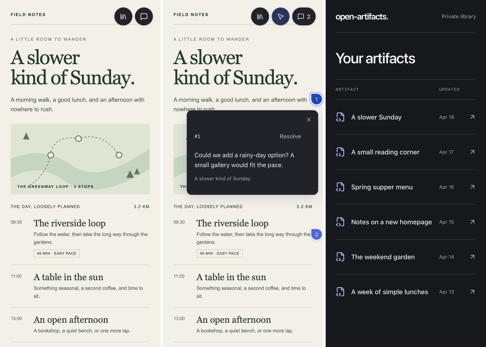
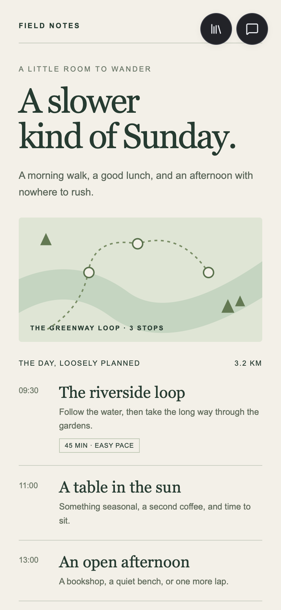
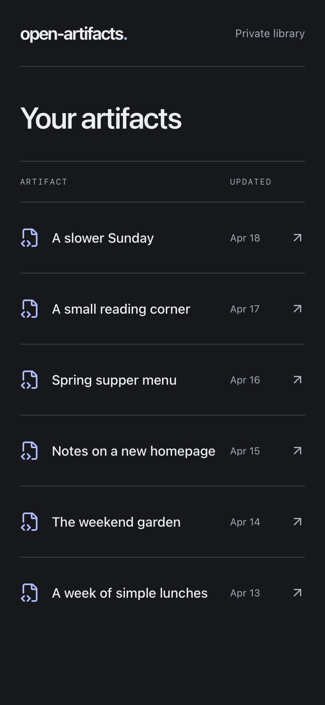

# open-artifacts

open-artifacts is a small plugin for Codex that takes inspiration from Claude's excellent artifact system. It gives Codex a structured way to create HTML pages that you can open in your browser and comment on directly. You can attach a comment to any element, and Codex can read your feedback

I use this for giving my input on large plans that benefit from visual elements, such as proposed designs. Codex might attach a dozen screenshots showing proposed changes to a website, for example, and I can comment on each directly. Codex can then retrieve those comments, apply my feedback, or revise the artifact for another round of review

It's built to work with Tailscale, also supports ChatGPT's Sites, and should work well with other harnesses (though that's untested)

<p align="center">
  <picture>
    <source media="(max-width: 600px)" srcset="docs/images/artifact-comment-mobile.png" width="240" height="519">
    
  </picture>
</p>

<details>
<summary>More screenshots</summary>

<p align="center">
  <a href="docs/images/artifact-mobile.png"></a>
  <a href="docs/images/library-mobile.png"></a>
</p>

</details>

## What it does

- Keeps your artifacts in a private library with past revisions.
- Lets you comment on text, elements, or areas of a page.
- Hands your comments to Codex so it can revise the artifact.

Single owner only. No sharing, no multi-user access, no public pages.

## Hosting

**Tailscale.** A small Node server on a machine in your tailnet, exposed with Tailscale Serve. Codex talks to it over native MCP, either HTTPS or stdio on the same machine. No browser or ChatGPT account involved. Artifacts live in a SQLite database in a directory you choose. This is the path I use; the [self-hosting guide](docs/SELF_HOSTING.md) walks through it.

**ChatGPT Sites.** The same app deployed as an owner-private Site with ChatGPT sign-in. Codex drives your signed-in browser, calling page tools through WebMCP where the browser supports it and filling in a plain form where it doesn't. Artifacts live in the Site's D1 database and R2 bucket.

You can configure one or both. The plugin has a saved default for new artifacts, and you can name a host for a single request. A link to an existing artifact always opens on the host it came from. There is no fallback between libraries.

## Getting started

(Point your agent at this.)

**Deploy a host.** For Tailscale, follow the [self-hosting guide](docs/SELF_HOSTING.md). For Sites, build the app and deploy it as an owner-private Site with `DB` (D1) and `FILES` (R2) bindings. `.openai/hosting.json` declares those two bindings and nothing else. If your deployment tooling adds a project ID to it, keep that out of anything you publish.

**Configure the plugin.** The plugin in `plugins/open-artifacts` ships with no connection settings. The helper writes a configured copy outside the repo:

```sh
# Tailscale
python3 plugins/open-artifacts/scripts/configure.py \
  --tailscale-url https://your-server.your-tailnet.ts.net:8444/mcp \
  --output /path/to/configured/open-artifacts

# Sites
python3 plugins/open-artifacts/scripts/configure.py \
  --site-url https://your-library.chatgpt.site \
  --output /path/to/configured/open-artifacts
```

Pass both URLs plus `--default tailscale` or `--default sites` to configure both. Install the configured copy in Codex. The [plugin README](plugins/open-artifacts/README.md) covers local stdio.

**Ask for something.** These work without naming a host:

- "Create an interactive artifact that..."
- "Read the comments on this artifact." (with the link)
- "Revise this artifact using its open comments."

## Commenting in the browser

Open an artifact from the library. The comment icon in the top right switches the viewer into placement mode.

- Click anywhere on the page to open a small editor next to that point.
- Drag from blank space to select an area. Dragging over text keeps normal text selection and captures the exact quote.
- Escape closes the editor. Placement mode stays on until you click the icon again.
- Click an existing pin to read it, resolve it, or reopen it. Codex's replies and addressed records show up under the note.
- The count control opens the full comment list and artifact options, including publishing a revision by hand and downloading the exact HTML.

If Codex publishes while you're mid-comment, the viewer holds the revision you were looking at until you finish or discard the note. On a later revision, a pin is placed only when the viewer finds a unique match for what you originally selected, using stable IDs and captured content rather than position. A comment whose target moved or disappeared stays in the list with its original context and a link to the revision it came from.

## What Codex can do

Both hosts expose the same actions. On Tailscale they're native MCP tools at `/mcp`. On Sites they're page tools discovered through WebMCP in the signed-in browser.

| Tool | What it does |
| --- | --- |
| `list_artifacts` | List artifacts with their current revision IDs. |
| `get_artifact` | Read one revision's metadata. Native MCP includes the HTML only when `includeHtml` is true. |
| `get_review_context` | Read every comment with its original target, captured input state, replies, and the revision history. |
| `publish_artifact` | Create a new artifact, or publish a revision of an existing one. |
| `create_review_batch` | Snapshot the open comments and their record versions before starting work. |
| `reply_to_comment` | Add a reply labeled as coming from the agent. Doesn't resolve the note. |
| `mark_addressed` | Record that a comment was handled in a specific newer revision. Doesn't resolve the note. |

Publishing takes a fresh UUID as `requestId`, a title, and a self-contained HTML document up to 512 KB. A revision also needs the `artifactId` and the current `baseRevisionId`. Retrying with the same request ID and payload returns the original result; the same ID with a different payload is rejected, and so is publishing against a stale base revision.

The revision loop: read the review context, create a batch, edit, publish, then mark each handled comment as addressed against that batch and revision. If a comment changed while Codex was working, the addressed call fails and Codex rereads it. Your notes stay open until you resolve them yourself.

The Sites page tools add `publish_geist_artifact` and `get_editable_artifact`, which let Codex work with a compact source file while the host fills in the Geist foundation, and `open_publisher`, which opens the publication form.

## Writing pages that review well

Any self-contained HTML works. A few attributes make comments survive revisions much better, and the plugin's skill already tells Codex to use them:

- Give meaningful sections a unique, stable `data-review-id`. Keep it when the section evolves, drop it when the section goes away.
- Add `data-review-state="some-key"` to an input, select, or textarea when its value helps explain a comment. Up to 19 controls are captured per comment. Radios and checkboxes record their checked state. Password fields are never captured, and keys starting with `__oa_` are reserved.
- Leave the top-right corner clear for the library and comment controls.
- Make it work at 390 px wide. I review a lot of these on my phone.

Don't mark credentials or private free-text fields for state capture. Captured state is stored with the comment and handed back to the agent.

## Security and limits

Read this before putting anything sensitive into an artifact.

**The iframe limits what a page can reach, not what it can send.** Artifacts run in an opaque-origin iframe with scripts allowed and nothing else: no same-origin access, forms, popups, downloads, or top-level navigation. A content security policy blocks normal network APIs and external assets. The frame can't read your session, see other artifacts, or call host tools. A page can still navigate itself, and navigation can carry data. Assume anything you type into an untrusted artifact could leave the frame.

**Reports from the frame are untrusted.** The frame tells the host where you clicked and what was under the cursor. The host checks the shape of that report and uses it only to fill in a draft. Saving a comment always happens on the host side.

**Every query is scoped to the owner.** On Tailscale, identity comes from the header Tailscale Serve attaches, and the server accepts only an exact match with the configured owner login. On Sites, it comes from the signed-in ChatGPT session. Tool arguments can't change who you are.

**Known gaps.** No native remote MCP or OAuth for Sites; `/mcp` on that host is only an identity probe. Comments can't be edited or deleted, and artifacts can't be deleted. Captured input state is stored but not restored when you revisit a comment. No export tooling and no automated backups; on Tailscale, stop the server and copy the data directory. It's meant for a small personal collection.

The [design notes](docs/DESIGN.md) cover the consistency model, review semantics, and runtime boundary. The [authentication notes](docs/AUTH_PROBE.md) cover what the local auth tests do and don't prove.

## Development

Requires Node 22.13 or newer.

```sh
npm ci
npm run db:generate     # only after changing db/schema.ts
npm run build
npx wrangler d1 execute DB --local --config dist/server/wrangler.json \
  --persist-to .wrangler/state --file drizzle/0000_productive_penance.sql
npm run dev -- --port 3002
```

The default build target is Sites. Apply the initial migration once per new local database and keep later generated migrations in order. Don't edit a migration that's already been deployed.

```sh
PROBE_BASE_URL=http://localhost:3002 npm run test:artifacts:local
PROBE_BASE_URL=http://localhost:3002 npm run test:probe:local
node scripts/check-comment-points-local.mjs
node --experimental-strip-types --test tests/review-target.test.mjs tests/comment-point.test.mjs
npm run test:plugins
npm run lint
npx tsc --noEmit
```

The artifact check writes synthetic records to the local database and refuses anything other than loopback. The local sign-in tests run against a simulator, not real ChatGPT auth.

The self-hosted target has its own scripts: `npm run build:selfhost`, `npm run dev:selfhost`, and `npm run test:artifacts:selfhost`. Both targets build into `dist/`, so build them one at a time. The [testing guide](docs/PLUGIN_TESTING.md) covers the browser fixtures and end-to-end agent tests.

## Releasing

```sh
npm run test:release
npm run package:plugin -- releases/open-artifacts-1.0.0.zip
```

This produces a ZIP of the unconfigured plugin with fixed timestamps and a printed SHA-256 digest. It refuses to package a plugin with connection settings filled in. The self-hosted server is a separate package built with `npm run package:selfhost`. See [releasing](docs/RELEASING.md).

## Documentation

- [Plugin setup and usage](plugins/open-artifacts/README.md)
- [Self-hosting with Tailscale](docs/SELF_HOSTING.md)
- [Design and boundaries](docs/DESIGN.md)
- [Authentication boundaries](docs/AUTH_PROBE.md)
- [Testing](docs/PLUGIN_TESTING.md)
- [Releasing](docs/RELEASING.md)
- [Licensing](docs/LICENSING.md)

## License

MIT. See [LICENSE](LICENSE). The bundled Geist fonts are separate and carry the SIL Open Font License; their license file ships alongside them in `plugins/open-artifacts/assets`.
